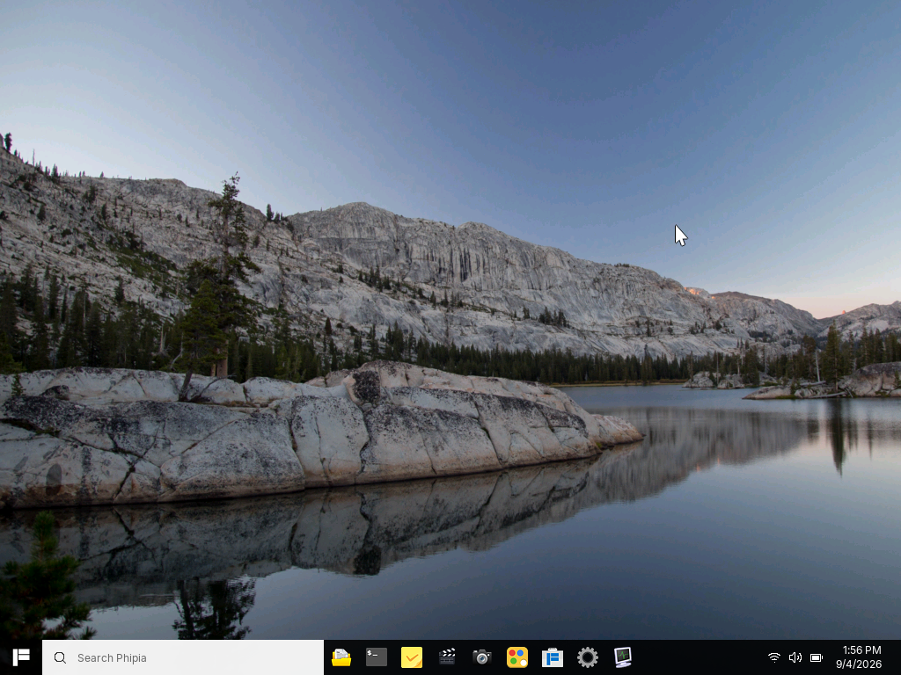

<p align="center">
  
</p>

<h1 align="center">Phipia</h1>

<p align="center"><strong>An x86_64 operating system built from first principles.</strong></p>

<p align="center">
  <a href="https://github.com/saudaljuaid/Phipia/actions/workflows/verify.yml"></a>
  
  <a href="LICENSE"></a>
</p>

<p align="center">
  
</p>

## Main mission

Our mission is to provide a stable and truthful operating system to the modern world!

## About

Phipia is an operating system built from scratch. The current development
release is Phipia 2.2.0.

## Highlights

- A 64-bit kernel built from scratch — no Linux inside.
- Drivers for real hardware: NVMe, USB, audio, networking.
- Runs real outside software — Lua and SQLite, natively.
- 117 automated QEMU scenarios on every change, including reboot and
  deliberate power-cut recovery paths.

## Build and boot

Ubuntu 24.04 (or similar), with a few standard tools.

```sh
sudo apt-get install binutils gcc grub-common grub-pc-bin make mtools \
    qemu-system-x86 xorriso
rustup target add x86_64-unknown-none

make run
```

That's it — it boots straight into QEMU. Run `make verify` first if you
want the full test suite to pass before you trust it!

## Design

C and assembly handle anything that touches real hardware. Rust's job is
narrower: check any bytes the kernel didn't create itself — a file, a
network packet — before C ever touches them. That same Rust also runs
native applications.

There's a Boot Ledger too — it just keeps track of what's started and in
what order, so nothing boots blind.

## Documentation

- [Architecture](docs/ARCHITECTURE.md)
- [Phipia desktop](docs/PHIPIA.md)
- [Persistent FAT32](docs/FAT32.md)
- [Networking](docs/NETWORKING.md)
- [Processes](docs/MULTIPROCESS.md)
- [Drivers](docs/DRIVERS.md)
- [HD Audio](docs/AUDIO.md)
- [SDL 2](docs/SDL.md)
- [NVIDIA](docs/NVIDIA.md)
- [Linux syscall boundary](docs/LINUX_SYSCALL_ABI.md)
- [Rust boundary](docs/RUST.md)
- [Verification](docs/VERIFICATION.md)
- [Third-party assets](docs/THIRD_PARTY_ASSETS.md)

See [CONTRIBUTING.md](CONTRIBUTING.md) before sending changes. Phipia is
licensed under [GPL-3.0-only](LICENSE).
